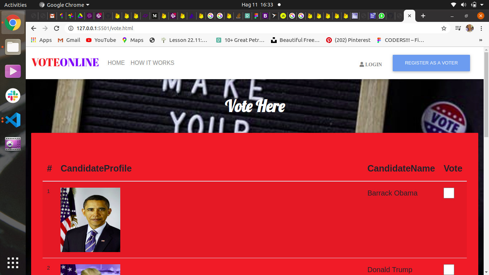

***

# Vote Online

#### **Tuesday AUGUST 4 2020** ;

***

#### By **Akumu Collins** ;

### Here is the **WebPage Screenshoot** ;

---

## Description
This is an app that allows users to register themselves as voters and are given multiple choices of making there choice to vote for the candidate of there choice.

***

## Setup/Installation Requirements
* get the project in github
* copy and  paste the clone link in your terimnal
* git clone https://github.com/Akumucollins/Voting-App.git to your local terminal
* cd to the project directory
* code . /atom . command  to open the text editor

---

## Technologies Used
* Html - For Building Mark Up pages
* css - For styling User Interface
* Jquery - For animations and cool effects of the website like hiding and showing elements
* Material Design Bootstrap -For making webpage responsive
* Mailchimp API -  For tracking all emails and messages from users input
* Bootstrap4 - For making webpage responsive
* Javascript - For document object manipulation

***
  
## Behaviour Driven Development
| Behaviour      | Input        | Output       |
| :------------- | :----------: | -----------: |
| Register Button | Full Name, Email Address, Username, Password  |  You have registered as a voter!! |
| Login Button | Email Address, Username, Password  | Logged in the voting section |
| Forgot Password |  Email Address, Password| A link was successfully send on your email!! |
| Show Result Button |  Select the Checkbox of a Candidate | You have voted for [checkbox selected] |

---

## Dependencies
* Mailchimp API
* Jquery
* Bootstrap

---

## Show Your Support
* Give a thumbs up if this project is of aid to you !

***

## Contact details
Feel free to contact me @ akumucollins001@gmail.com  if there are any bugs. 

---

## License
The project is [MIT](LICENSE) licensed  

***